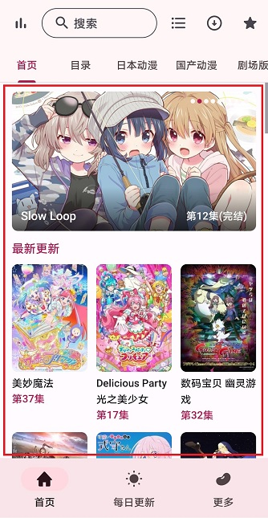
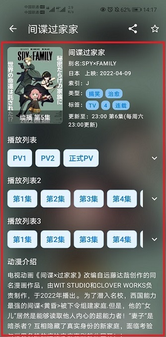
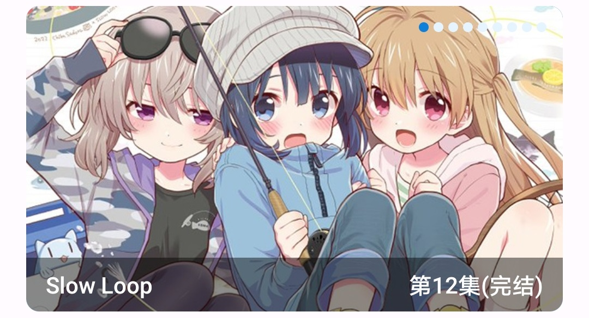
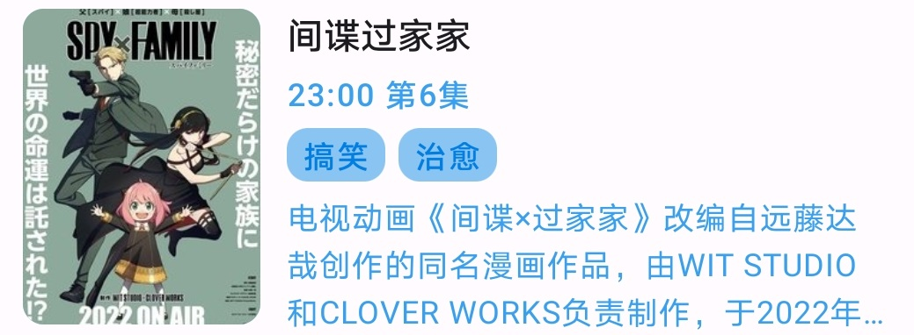
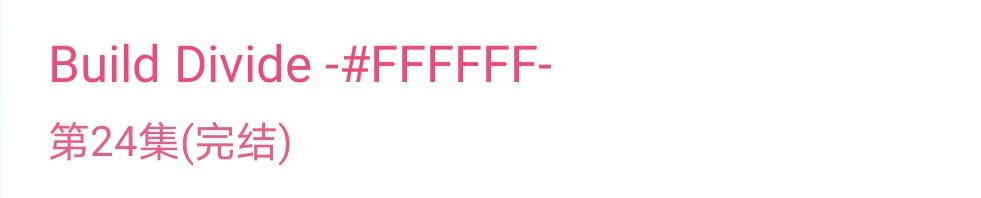
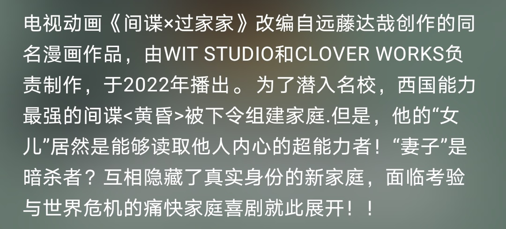
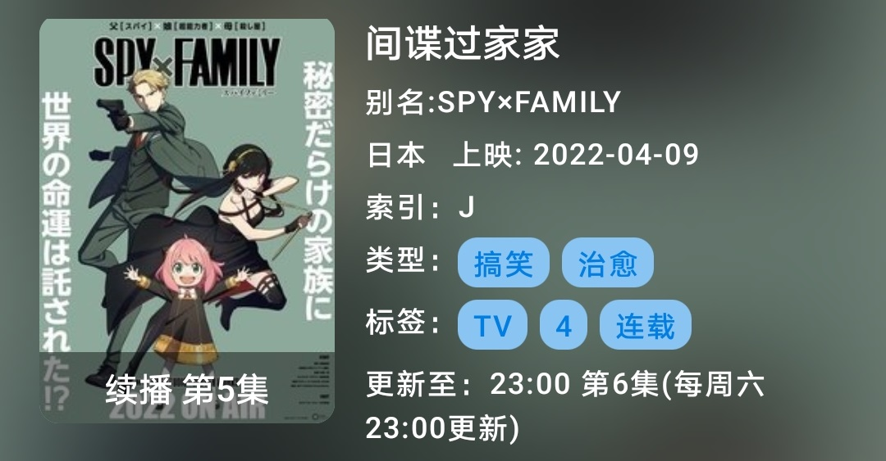
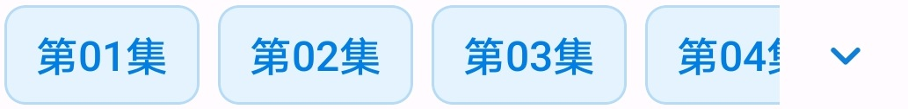

# 列表子项类型与布局/数据对应文档（适用于编写数据源/后端的人员）

## 什么是列表和列表子项？

如下图**红框**内的均为一个**列表**，其中的**内容**均为列表的一个**子项**（又叫**Item**），其中**子项又可以是一个列表**（**列表嵌套**）。

**列表对应Kotlin中的List\<Any\>，Java中的List\<Object\>**，而子项对应List的每一项。

|                       首页                        |                         动漫详情页面                         |
| :-----------------------------------------------: | :----------------------------------------------------------: |
|  |  |

## 什么是列表子项的类型？

上图中列表内容**多种多样**，每一个**Item**都属于**某一个类型**。例如：第一幅图的“最近更新”属于“Header1”类型，而轮播属于“Banner1”类型。

|              “Header1”类型              |              “Banner1”类型              |
| :-------------------------------------: | :-------------------------------------: |
|  |  |

## 列表子项类型（仅列举数据源可用类型）

|          类型           |                             布局                             | 对应的实体类（均在com.skyd.imomoe.bean包下） |                             备注                             |
| :---------------------: | :----------------------------------------------------------: | :------------------------------------------: | :----------------------------------------------------------: |
|       AnimeCover1       |  |               AnimeCover1Bean                |                                                              |
|       AnimeCover2       |                                                              |               AnimeCover2Bean                |                         **暂未使用**                         |
|       AnimeCover3       |  |               AnimeCover3Bean                |                                                              |
|       AnimeCover4       |  |               AnimeCover4Bean                |                                                              |
|       AnimeCover5       |  |               AnimeCover5Bean                |                                                              |
|       AnimeCover6       |  |               AnimeCover6Bean                |                   注意**与Banner1的区别**                    |
|      AnimeCover10       |  |               AnimeCover10Bean               | 与**AnimeCover12基本一样**，但**不支持换肤**，建议仅用做**桌面微件** |
|      AnimeCover11       |  |               AnimeCover11Bean               |                                                              |
|      AnimeCover12       |  |               AnimeCover12Bean               |                                                              |
|     AnimeDescribe1      |  |              AnimeDescribe1Bean              |                                                              |
|         Header1         |  |                 Header1Bean                  |                                                              |
|         Banner1         |  |                 Banner1Bean                  |                                                              |
|      AnimeEpisode1      |  |              AnimeEpisode1Bean               |     目前仅用作**HorizontalRecyclerView1**类型的**子项**      |
|       AnimeInfo1        |  |                AnimeInfo1Bean                |                                                              |
|       AnimeType1        |  |                AnimeTypeBean                 |         **AnimeInfo1**中的**标签内容**“TV”、“搞笑”等         |
| HorizontalRecyclerView1 |  |         HorizontalRecyclerView1Bean          |                                                              |
|      SpinnerItem1       |  |                 ClassifyBean                 |      目前仅用作**分类页面的分类**，如**字母**、**地区**      |
|      ClassifyTab1       |  |               ClassifyTab1Bean               | 目前仅用作**分类页面分类的子类型**，如字母的**A**，地区的**大陆** |
|    GridRecyclerView1    |               只是一个能显示其他Item的**列表**               |         GridRecyclerView1/ArrayList          |                 目前仅在**每日更新页面**使用                 |
|           Tab           |  |                   TabBean                    |                   首页和排行榜上方的Tab等                    |


## 页面可用类型对应 及 数据源接口方法对应示例JSON

### ⚠注意⚠：后端返回的JSON中，每个Object必须带有一个type字段，其值为Item对应的实体类名，以便APP能够区分将Object解析为哪个实体类（⚠给出的示例JSON未包含type字段）

### 例如：下方代码包括两个Object，其type分别为"AnimeCover1Bean"和"ImageBean"

```json
{
	"type": "AnimeCover1Bean",
    "cover": {
    	"type": "ImageBean",
        "referer": "http://xxx.xxx.xxx/",
        "actionUrl": "",
        "url": "http://xxx.xxx.xxx/news/2022/04/03/20220403104341348.jpg"
    },
    "episode": "第10集",
    "route": "/show/5548.html",
    "title": "武映三千道",
    "url": "http://xxx.xxx.xxx/show/5548.html"
}
```

### 首页（HomeFragment、AnimeShowFragment）

[IHomeModel](rv_item/json/IHomeModel)

[IAnimeShowModel](rv_item/json/IAnimeShowModel)

| HomeFragment支持的类型 |
| :--------------------: |
|          Tab           |

| AnimeShowFragment支持的类型 |
| :-------------------------: |
|         AnimeCover1         |
|         AnimeCover3         |
|         AnimeCover4         |
|         AnimeCover5         |
|           Banner1           |
|           Header1           |

### 每日更新页面（EverydayAnimeFragment）

[IEverydayAnimeModel](rv_item/json/IEverydayAnimeModel)

| EverydayAnimeFragment支持的类型 |
| :-----------------------------: |
|        GridRecyclerView1        |

### 动漫详情页面（AnimeDetailActivity）

[IAnimeDetailModel](rv_item/json/IAnimeDetailModel)

| AnimeDetailActivity支持的类型 |
| :---------------------------: |
|          AnimeCover1          |
|        AnimeDescribe1         |
|          AnimeInfo1           |
|            Header1            |
|    HorizontalRecyclerView1    |

### 播放页面（PlayActivity）

[IPlayModel](rv_item/json/IPlayModel)

|               PlayActivity支持的类型                |
| :-------------------------------------------------: |
|                     AnimeCover1                     |
| AnimeCover2（**未测试**是否安全和有效，不建议使用） |
|                       Header1                       |
|               HorizontalRecyclerView1               |

### 搜索页面（SearchActivity）

[ISearchModel](rv_item/json/ISearchModel)

| SearchActivity支持的类型 |
| :----------------------: |
|       AnimeCover3        |

### 分类页面（ClassifyActivity）

[IClassifyModel](rv_item/json/IClassifyModel)

| ClassifyActivity支持的类型 |
| :------------------------: |
|        AnimeCover3         |
|        SpinnerItem1        |
|        ClassifyTab1        |

### 排行榜页面（RankActivity、RankFragment）

[IRankModel](rv_item/json/IRankModel)

[IRankListModel](rv_item/json/IRankListModel)

| RankActivity支持的类型 |
| :--------------------: |
|          Tab           |

| RankFragment支持的类型 |
| :--------------------: |
|      AnimeCover3       |
|      AnimeCover11      |

### 季度更新动漫页面（MonthAnimeActivity）

[IMonthAnimeModel](rv_item/json/IMonthAnimeModel)

| MonthAnimeActivity支持的类型 |
| :--------------------------: |
|         AnimeCover3          |

### 每日更新微件（小组件）

[IEverydayAnimeWidgetModel](rv_item/json/IEverydayAnimeWidgetModel)

|  支持的类型  |
| :----------: |
| AnimeCover10 |

